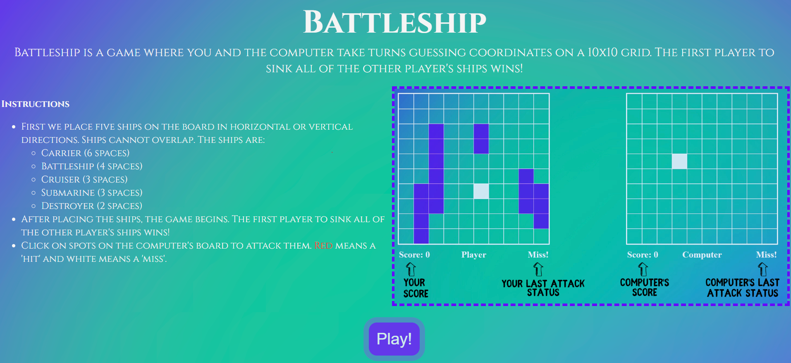

# BattleShip

### An engaging battleship game created using vanilla JavaScript, offering a richly detailed experience with immersive gameplay mechanics and a sleek user interface.

<table>
  <td align="center"><b>Made using:</b></td>
  <td> 
    
    
    
    
    
  </td>
</table>

###### Additional libraries used: css-loader, gh-pages [For deployment], html-webpack-plugin [To generate output html pages], babel [compatibility], jest [Unit Tests], webpack-dev-server [For development]

## **Click on the pictures/the link below to try!**

## [Click to open](https://redplusblue.github.io/battleship/)

## Features:

1. Spans across multiple pages, with separate modules, html files and stylesheets.
2. Allows user to choose user name, customize ship placement, and ship orientation, with a preview of the ship's position.
3. Allows user to opt to randomize ship placement.
4. Allows user to play against a computer, with an AI of varying difficulty.
5. Stores last game's scores and displays them on the main menu.

## What I used/learned:

1. JS: Modules, Classes, Objects, Arrays, Functions, DOM manipulation, Event Listeners, Local Storage, Jest.
2. CSS: Multiple animations, multiple stylesheets, multiple nested layouts of varying complexity.

 

### What I did well (I think):

1. Code is clean and modularized. DOM manipulation is limited to certain modules only. Object manipulation is limited to certain modules only.
2. Webpage is aligned and styled proportionately, with minimalism in mind. Most of the elements are aligned to the center, and symmetrical. Sudden changes in layout are reduced to a minimum and animations are used to smoothen the transition.
3. User experience is smooth and intuitive, with a lot of feedback to the user, and a lot of options to customize the game.
4. The AI is not perfect, but it is not dumb either. It is able to make smart decisions, and is able to make mistakes.

### What I could've done better (Working on it...):

1. The AI could be more intelligent, and could be more efficient.
2. The game could have more graphical elements.
3. The game could have a player vs player mode.
4. Some of the commits were lost because not pushing to remote repository often enough, which resulted in a lot of changes being less organized than they could have been.

 

###### An exercise for [TheOdinProject](theodinproject.com)
